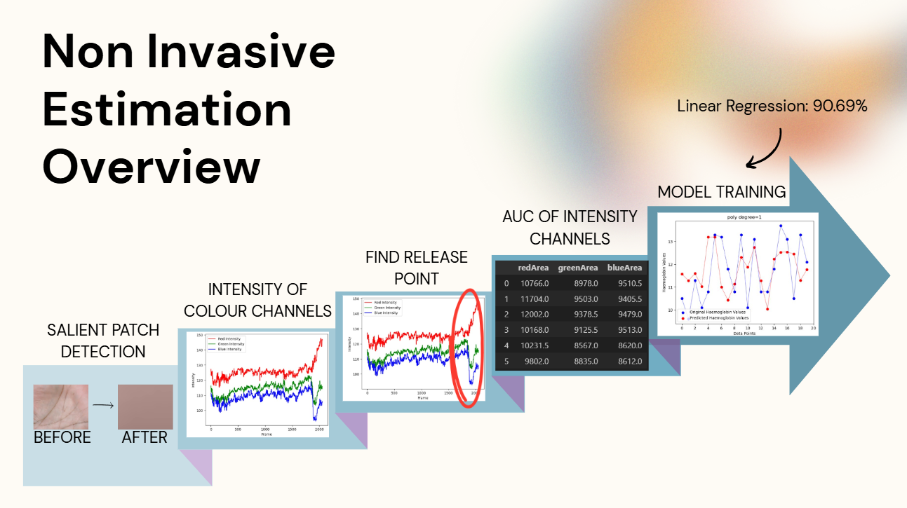

# Non-Invasive Haemoglobin Estimation using ML and FPGA

A portable, affordable, and real-time solution for estimating haemoglobin (Hb) levels using non-invasive techniques. This project uses palm/finger video frames to estimate Hb concentrations via machine learning and deploys the model on an FPGA (Zynq ZCU-104) for hardware-accelerated inference.

---

## Problem Statement

Conventional haemoglobin testing is:
- 🩸 **Invasive** (requires blood draws)
- ⌛ **Time-consuming** (lab processing delays)
- 💸 **Expensive** (equipment, reagents)

> **Goal**: Develop a low-cost, non-invasive, and real-time method to estimate haemoglobin levels — accessible even in low-resource settings.

## Non Invasive Estimation (ML)

  

*Figure: High-level pipeline for non-invasive haemoglobin estimation.*

### Approach
1. **Palm/finger imaging** using controlled occlusion (via cuff)
2. **Feature extraction**:
   - Salient patch detection
   - Color channel intensity & AUC analysis
   - Release point detection
3. **Model training**:
   - Linear Regression model achieves ~90.7% accuracy
   - RMSE: 1.30 | Pearson r: 0.11

###  Notebooks
- `ml_training_pipeline.ipynb`: Preprocessing, feature extraction (AUC, release points), classifier trials

## Hardware Deployment (FPGA)

### Why FPGA?
- ⏱️ Real-time inference
- 🔌 Low power
- 🌐 No internet dependency
- 🧩 Easy integration into edge medical devices

### Deployment Pipeline
1. Convert trained Linear Regression model → Optimized C++ code
2. Use **Vitis HLS** to synthesize RTL (Verilog) from C++
3. Integrate RTL in **Vivado** and generate `.bit`, `.hwh`, `.xsa`
4. Use **PYNQ** on Zynq ZCU104 board for hardware-accelerated inference
   - `run_fpga_inference.ipynb`: Inference pipeline on Zynq FPGA using PYNQ and Jupyter

## Project Structure
Non-Invasive-Haemoglobin-Estimation/ 
├── **fpga/** *(Bitstream and hardware description files)* 
│ ├── design_1_wrapper.bit 
│ ├── design_1.hwh 
│ ├── design_1_wrapper.xsa 
│ ├── linear_regression.cpp 
│ └── linear_regression.h 
├── **notebooks/**  *(Jupyter notebooks for ML training and FPGA inference workflows)* 
│ ├── ml_training_pipeline.ipynb *(Feature extraction and model training (AUC, release points, classifiers))* 
│ ├── patch_detection.ipynb *(Salient patch detection (11x11) using sliding windows)* 
│ └── run_fpga_inference.ipynb *(Hardware-accelerated inference on Zynq using PYNQ and Jupyter)* 
├── **docs/**  
│ └── PPT.pdf 
├── **data/**  
|  ├── data.csv 
|  └── labels.csv 
└── README.md 

## Results

| Metric            | Value        |
|-------------------|--------------|
| RMSE              | 1.3041       |
| Accuracy          | 90.05%       |
| Pearson Correlation (r) | 0.1112  |

## Next Steps
- Integrate with a **camera module** and **micro-occlusion cuff**
- Explore **LSTM or RNN-based** models for temporal color shift tracking
- Build a fully embedded **point-of-care haemoglobin testing device**
